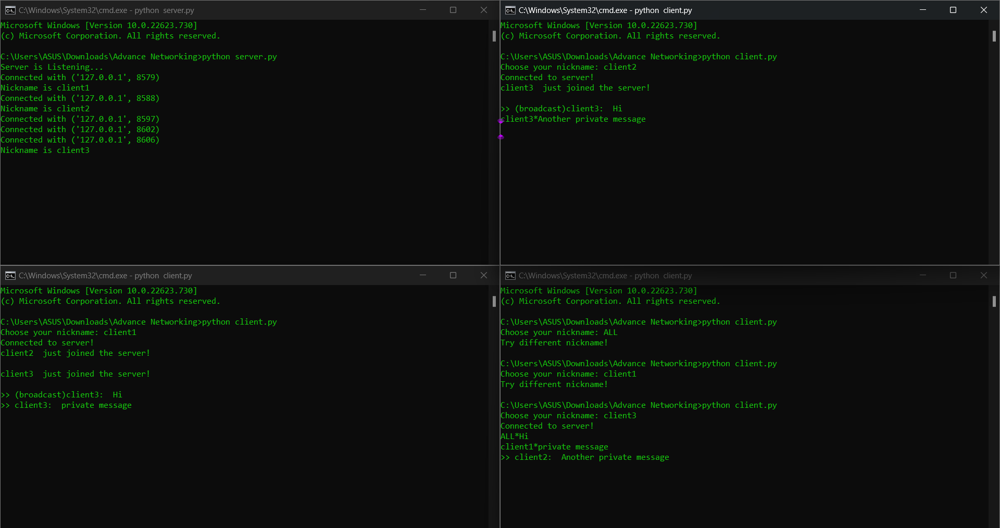
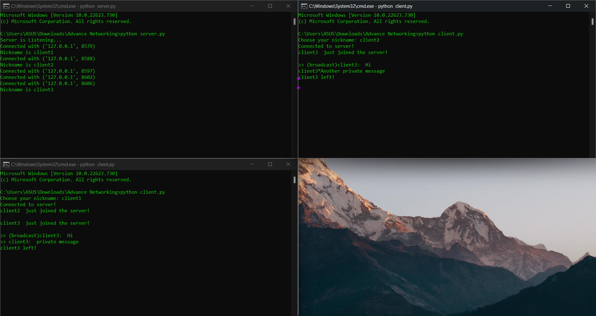

# Server-Client-based-multiple-users-CHAT-Application
In this project you are going to build a networking system based application that has a server which can accept multiple client requests. You can use python based socket
programming in order to create the system. Each client can connect to the server anytime by sending a network request containing an IP, the server's port address and a unique name. Client’s name can never be ‘ALL’. The following tasks on the server side need to be done carefully.
- The server will print on its screen a confirmation message like “[The latest client name] just joined the chat” after receiving each request. And broadcast a message "[The latest client name] just joined the server”.
- If the server accepts a request with a name “ALL”, it will immediately discard the request.
- If the server accepts a request with a name that is already on the server, it will immediately discard the request.

After connection setup, a client can send a message either to a specific client or to all of the clients.
1. When client A(Ashik) sends a message to client B (Rafid), a specific protocol has to be followed:
>          Rafid*Hello, How are you?
Basically, the format is **RecevierName*Message**
The server then will handle this issue and send the message to the specific receiver client.
2. Another protocol needs to be followed by the sender when it wants to broadcast a message, that is, to send a message to all of the clients
The format for this task is: **ALL*Message**
If the client wants to broadcast a message, he has to write:
>          ALL*hey, how are you all?
The server will have to handle this issue and send the message to all the clients.

-Extension:
A simple encryption function could be like replacing each alphabet in the message with the next alphabet, i.e., if any client writes “abc” then it will be ‘bcd’ after encryption. The server will receive ‘bcd’ and it will just simply disperse it. When a client receives a message, it has to decrypt the message by replacing each alphabet in the received message with the previous alphabet. So ‘bcd’ will become ‘abc’ after decryption.
**If the message is “xyza”, then it will be “yzab” after encryption.
If the message is “zpaz”, then it will become “yozy” after decryption.**

# Command prompt commands
- Go to the folder which contains ***server.py*** & ***client.py***
- Run **command prompt** on this folder
- One for **Server** & One for each **Client**

## To run ***server.py***:
```
python server.py
python client.py
```

## To run ***client.py***:
```
python client.py
```
# Output




